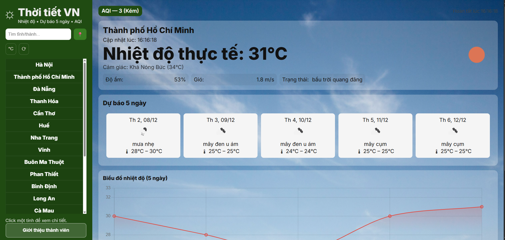
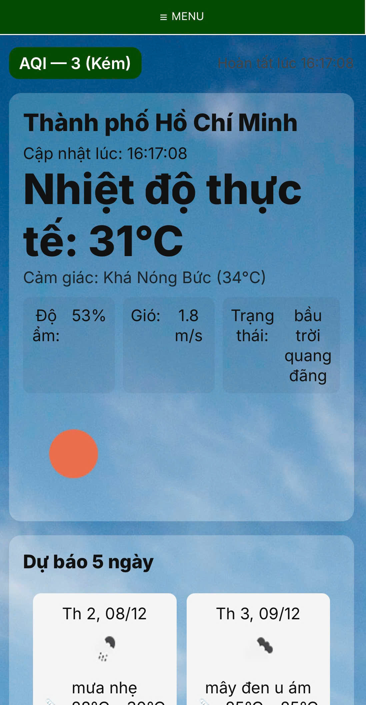

# 🌤️ Website thông tin dự báo thời tiết

> “Một dự án thiết kế web, Website dự báo thời tiết theo thời gian thực, hỗ trợ tìm kiếm thành phố, lấy vị trí hiện tại, hiển thị nền động theo điều kiện thời tiết và nhiều tiện ích khác.”
 <p align="center">
        
		
    </p>

---

## 🚀 Tính năng nổi bật
#### 🔍 Tìm kiếm thành phố để xem thông tin thời tiết nhanh chóng.
#### 📍 Tự động lấy vị trí hiện tại (Geolocation).
#### ☀️ Nền động thay đổi theo điều kiện thời tiết (mưa, nắng, nhiều mây…).
#### 🌡️ Hiển thị đầy đủ:
- 	Nhiệt độ
- 	Tình trạng thời tiết
-	Độ ẩm
-	Tốc độ gió
-	Chỉ số AQI (nếu có)
#### 📱 Giao diện responsive, đẹp trên cả điện thoại lẫn máy tính.
#### 🎨 Giao diện động
- Nền thay đổi theo điều kiện thời tiết:
  - Nắng: Hình có nắng
  - Mưa: Hình có những giọt mưa
  - Mây: Hình có những đám mây quang đãng
- Animation mượt mà
- Responsive trên mọi thiết bị

#### 📊 Biểu đồ thống kê
- Biểu đồ nhiệt độ theo ngày
- Biểu đồ dự báo 5 ngày
- Trực quan hóa dữ liệu bằng Chart.js
#### ⚡ Load nhanh, tối ưu API request, cache thông minh.
---

## 🛠️ Công nghệ sử dụng
- **HTML**: Cấu trúc trang web
- **CSS**: Styling và animation
- **JavaScript**: Logic xử lý
- **Chart.js**: Vẽ biểu đồ thống kê
- **Weather API**: Lấy dữ liệu thời tiết real-time
  - OpenWeatherMap API
  - hoặc WeatherAPI.com
---

## 📁 Cấu trúc thư mục
- ├── index.html
- ├── Spcirt.js
- ├── Style.css
- ├── Chart.js
- ├── intro.html
- ├── Images/
- └── README.md
---

## 🚀 Cài đặt và sử dụng

### Yêu cầu
- Trình duyệt web hiện đại (Chrome, Firefox, Safari, Edge)
- Kết nối internet
- API key từ OpenWeatherMap hoặc WeatherAPI

### Các bước cài đặt

1. **Clone repository**
```bash
git clone https://github.com/ttn238/web_du_bao_thoi_tiet.git
cd web_du_bao_thoi_tiet
```

2. **Cấu hình API Key**
- Đăng ký tài khoản tại [OpenWeatherMap](https://openweathermap.org/api)
- Lấy API key miễn phí
- Thêm API key vào file `Script.js`:
```javascript
const API_KEY = 'YOUR_API_KEY_HERE';
```

3. **Chạy ứng dụng**
- Mở file `index.html` bằng trình duyệt
- Hoặc sử dụng Live Server trong VS Code

## 📱 Hướng dẫn sử dụng

1. **Mở Link**: Mở web dự báo thời tiết lên bằng Link: [Dự báo thời tiết](https://thoitietvn.infinityfreeapp.com/)
1. **Tìm kiếm thành phố**: Nhập tên thành phố vào ô tìm kiếm và nhấn Enter hoặc là ấn vào ô có tên thành phố ở thanh bên trái
2. **Xem chi tiết**: Thông tin thời tiết hiển thị ngay lập tức
3. **Xem biểu đồ**: Kéo xuống để xem dự báo chi tiết theo giờ và theo ngày
---

## 🌐 Kiến thức áp dụng
### ⚙️ Đây là những công nghệ & kỹ thuật được sử dụng trong quá trình thiết kế website:

#### 🏗️ Frontend
- HTML5: Semantic layout, cấu trúc chuẩn SEO.
- CSS3: Flexbox, Grid, responsive design, animation.
- Responsive: Tối ưu cho mobile, tablet, desktop.
- UI/UX: Khoảng cách, màu sắc, độ tương phản, hierarchy, hover-state.
  
#### 💡 JavaScript:
- DOM Manipulation (thay đổi UI theo thời gian thực).
- Event Listener: click, input, search, geolocation.
- Fetch API: gọi API thời tiết / dữ liệu ngoài.
  
#### 🔌 API & Dữ liệu:
- OpenWeatherMap / AQI API.
- Xử lý JSON, validate dữ liệu, xử lý lỗi request.

#### 🛠️ Công cụ hỗ trợ 
- Live Server / Vite khi dev.
- Git + GitHub để quản lý phiên bản.
- Kiểm thử trên mobile thực tế.
---

## 🧩 Định Hướng Phát Triển Web

- ✅ Dark/Light Mode tự động theo hệ thống.
- ✅ Animation mềm mại (fade-in, slide-up, loading).
- ✅ Bản đồ thời tiết (Mapbox / Leaflet).
- ✅ Lịch sử tìm kiếm + gợi ý thông minh.
- ✅ PWA (Progressive Web App) → cho phép cài như app mobile.
- ✅ Chuyển sang Backend nhỏ (Node.js) để ẩn API KEY.
- ✅ Tối ưu SEO + performance theo Lighthouse.
- ✅ Thiết kế UI Giáng Sinh / Tết / Chủ đề mùa (theo event).
--- 

## 🎓 Bài học đạt được 
- Hiểu rõ cách tổ chức file: index.html, Style.css, Script.js, Chart.js,Images.
- Biết cách chia component UI: header, sidebar, body, card,…
- Biết tư duy responsive và thiết kế đa nền tảng.
- Hiểu luồng dữ liệu: input → xử lý JS → hiển thị HTML.
- Thành thạo gọi API, xử lý lỗi và phối hợp giao diện.
- Cải thiện tư duy UI/UX thực tế, không chỉ code giao diện.
- Nắm cách tối ưu hiệu năng và tránh duplicate request.
--- 

## 📚 Tài liệu tham khảo 
- MDN Web Docs: https://developer.mozilla.org/
- W3Schools HTML/CSS/JS: https://www.w3schools.com/
- TailwindCSS: https://tailwindcss.com/
- OpenWeatherMap Docs: https://openweathermap.org/api
- UI Inspiration: https://dribbble.com / https://uiverse.io
- Responsive Design: https://responsivedesign.is/
- Async/Fetch Basics: https://javascript.info/async
---

## 📌 Lưu ý
- API là bản miễn phí nên có giới hạn tỉnh/thành tìm kiếm.
## 👩‍💻 Tác giả
**Huỳnh Gia Bảo** - **Lê Quang Chí** - **Nguyễn Ngọc Ngà** - **Trần Thảo Nương** – Sinh viên **Công nghệ thông tin**, **Trường Đại học Giao thông Vận tải – Phân hiệu TP.HCM (UTC2)**.
> “Web Dự báo thông tin thời tiết – dự án giúp mình rèn luyện kỹ năng frontend & học cách xây dựng một sản phẩm hoàn chỉnh từ giao diện tới logic.”
---

#### 🌈 Chúc bạn có một trải nghiệm vui vẻ !
